# Smart IoT Sensor built with XIAO ESP32C6

**Wi-Fi, MQTT, BME280/BME680/SGP41 Integration & Power Management**

## Table of Contents

- [Introduction](#introduction)
- [Features](#features)
- [Usage](#usage)
- [Schematics](#schematics)
- [Configuration](#configuration)
- [Enclosure](#enclosure)
- [Integration with Home Assistant](#integration-with-home-assistant)
- [Getting Started](#getting-started)
- [Hardware](#hardware)
- [Software](#software)
- [ZigBee](#zigbee)
- [Contributing](#contributing)
- [License](#license)
- [TODO](#todo)

## Introduction

The Smart IoT Sensor is a power-efficient device built using the [XIAO ESP32C6](https://wiki.seeedstudio.com/xiao_esp32c6_getting_started/) tiny board. It integrates Wi-Fi connectivity, MQTT messaging, environmental sensing with BME280/BME680 sensors, and robust power management, making it an ideal solution for smart home and IoT applications.


## Features

- **Wi-Fi Connectivity**: Seamless connection to your home or office network.
- **MQTT Integration**: Publishes sensor data to an MQTT broker in JSON format.
- **Environmental Sensing**: Supports [Bosch BME280](https://www.bosch-sensortec.com/products/environmental-sensors/humidity-sensors-bme280/) and [BME680](https://www.bosch-sensortec.com/products/environmental-sensors/gas-sensors/bme680/) sensors for temperature, humidity, and pressure measurements. Supports [Sensirion SGP41](https://sensirion.com/products/catalog/SGP41) VOC and NOx sensor.
- **Power Management**: Efficiently manages power using LiPo batteries with built-in charge management.
- **Deep Sleep Mode**: Extends battery life by enabling deep sleep between data transmissions.
- **ZigBee Connectivity**: Seamless integration with ZigBee networks. Supports standard ZigBee clusters, easily pair your sensor with ZigBee coordinators like Home Assistant.
- **Optional Features**:
  - Battery voltage monitoring
  - Connection duration tracking
  - Future support for Wi-Fi 6 and Bluetooth provisioning (TODO)

## Usage

The Smart IoT Sensor can be easily integrated with [Home Assistant](https://www.home-assistant.io/) for real-time monitoring and automation.

### MQTT Data Structure

The sensor publishes data to an MQTT broker in the following JSON format:

```json
{
  "ID": "7i29r9k9ltaxmbev",
  "RSSI": -54,
  "battery_voltage": 4.13,
  "temperature": "24.28",
  "humidity": "29.32",
  "pressure": "999.54",
  "connection_duration_ms": 1672
}
```

- **ID**: Unique identifier of the sensor
- **RSSI**: Wi-Fi signal strength in dBm
- **battery_voltage**: Current battery voltage
- **temperature**: Temperature reading from the BME sensor
- **humidity**: Humidity reading from the BME sensor
- **pressure**: Pressure reading from the BME sensor
- **connection_duration_ms**: Time taken to establish the MQTT connection

## Schematics

### Battery Connection


_A battery connection schematic._

### Voltage Divider


_Voltage divider schematic (if battery voltage monitoring is required)._

**Note:** This solution continuously consumes some current from the battery but is functional for voltage monitoring.

### BME280/BME680 Connection

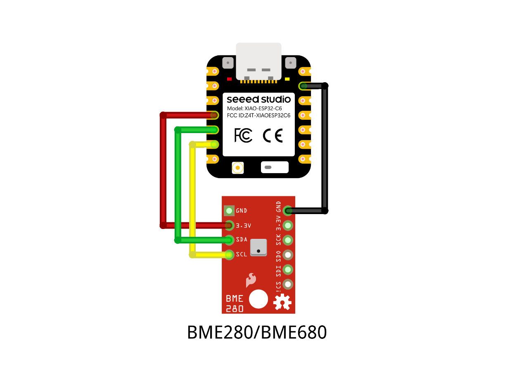

### SGP41 Connection

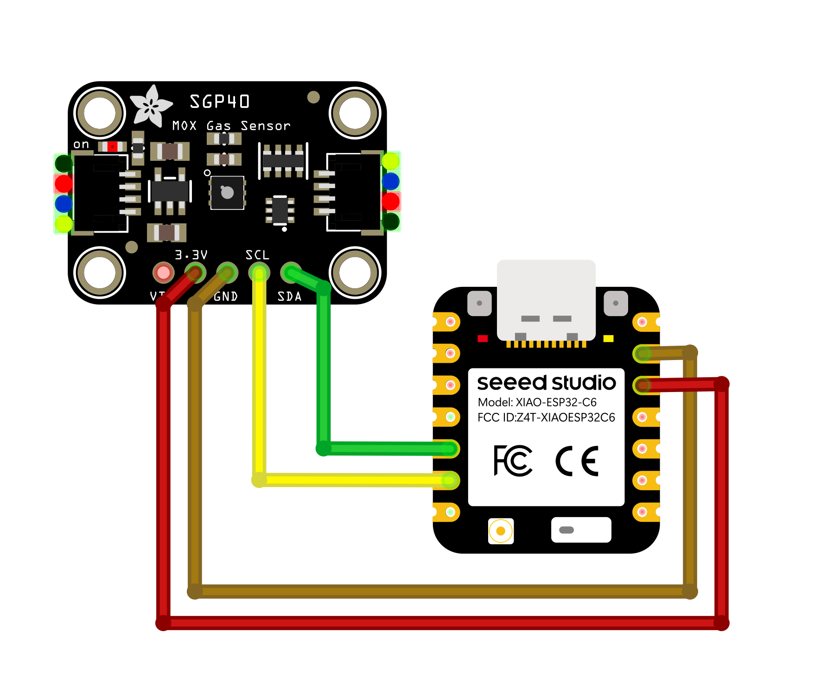

## Configuration

This build was developed and tested with [ESP-IDF v5.3.1](https://github.com/espressif/esp-idf/releases/tag/v5.3.1)
Follow [this instruction](https://docs.espressif.com/projects/esp-idf/en/v5.3.1/esp32/get-started/index.html#manual-installation) to install it. It is required.

Configure the sensor using the following steps:

```
idf.py menuconfig
```

Then go to `XIAO Sensor Configuration`

1. **Wi-Fi Configuration**: Set up your Wi-Fi credentials to enable network connectivity.
2. **MQTT Configuration**: Connect the sensor to your MQTT server by providing the necessary broker details.
3. **Battery Check (Optional)**: Enable battery voltage monitoring if power management insights are needed.
4. **BME Sensor Configuration (Optional)**: Choose between BME280, BME680 and SGP41 sensors based on your requirements.
5. **Power Management Configuration**: Set up wakeup duration, which is the duration in seconds that the device will remain in deep sleep before waking up.

6. 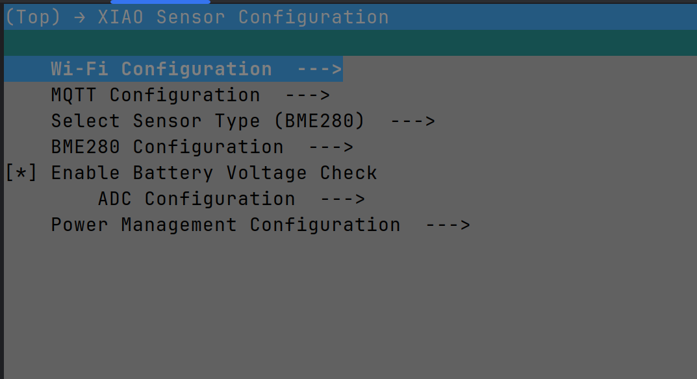

## Enclosure

The sensor is housed in a customizable 3D-printed enclosure. [STL files](3d/enclosure/stl) are available for download and 3D printing.
To customize a model use a [FreeCAD project](3d/enclosure/XIAO_ESP32C6_Enclosure.FCStd).
A 3D preview is available [here](https://begoonlab.tech/cad_design/instructables.com/XIAO_ESP32C6_Enclosure.html).

When printing, it is recommended to orient the parts on the hotbed as shown in the picture:

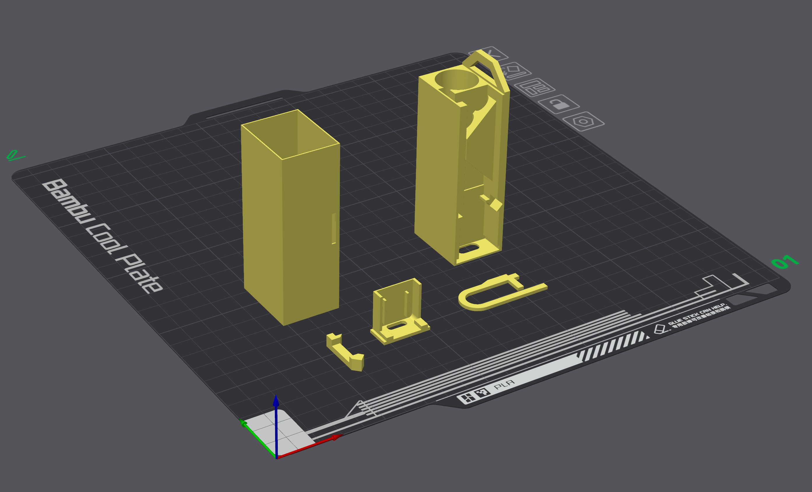

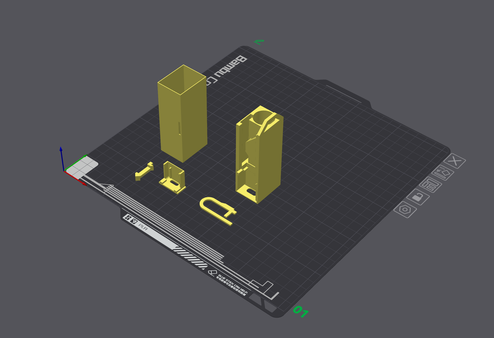

Enclosure assembly steps:

1. Insert XIAO board into [SoC_holder](3d/enclosure/stl/soc_holder.stl) :

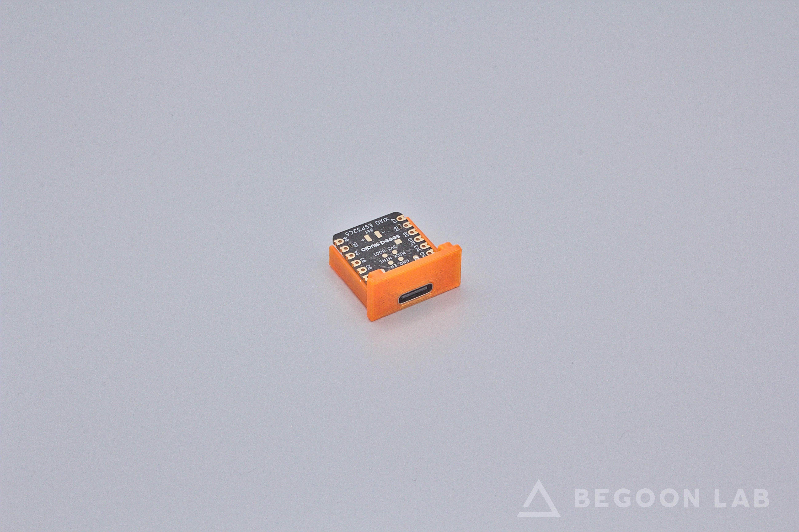

2. Insert holder into the [core part](3d/enclosure/stl/core.stl) :

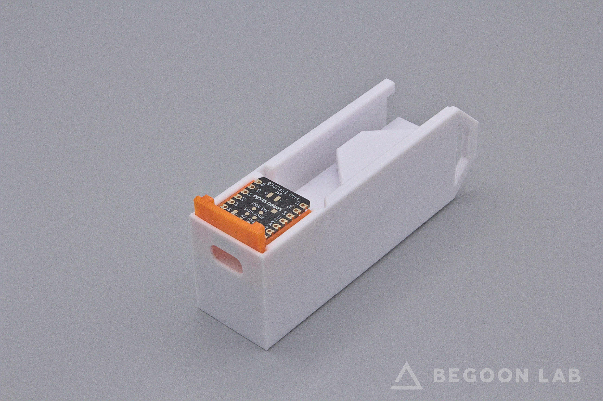

Pull down until it can't go any farther

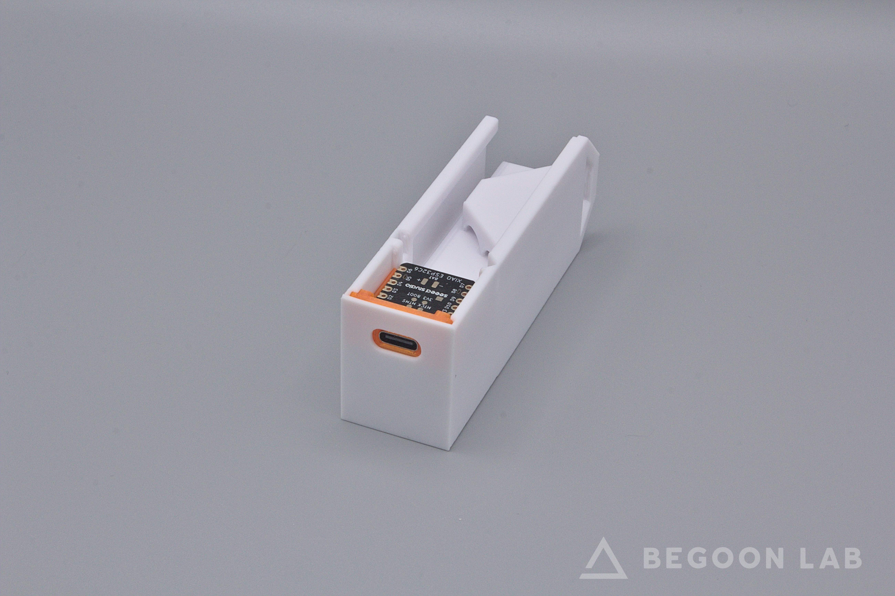

3. Insert [SoC bracket](3d/enclosure/stl/soc_bracket.stl) :

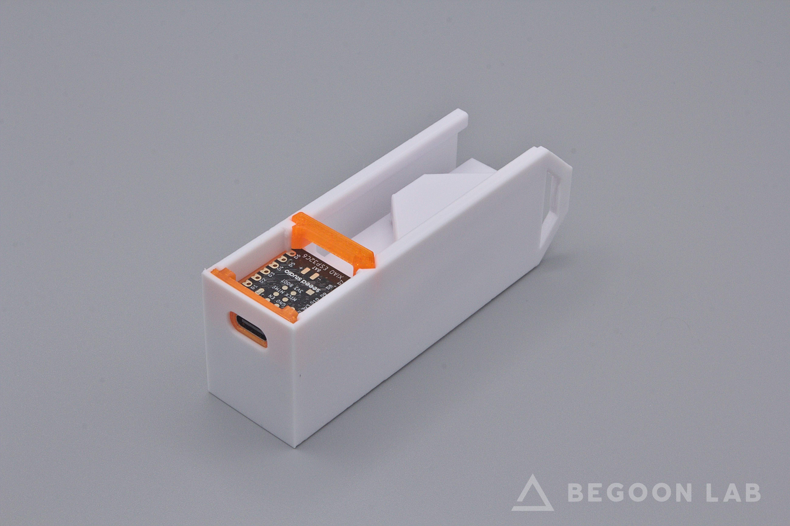

4. Insert BME sensor

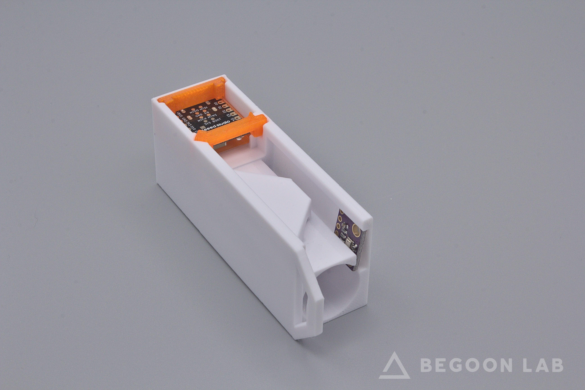

5. Attach an antenna. Put the coaxial wire into the channels in the core part. Use a couple of drops of glue or double-sided tape to secure the antenna in its place.

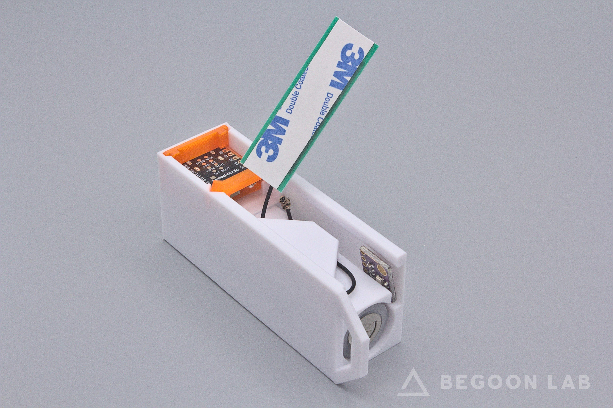

6. Now solder up everything together according to [schematics](#schematics). And repeat an assembly steps if everything fits nicely.

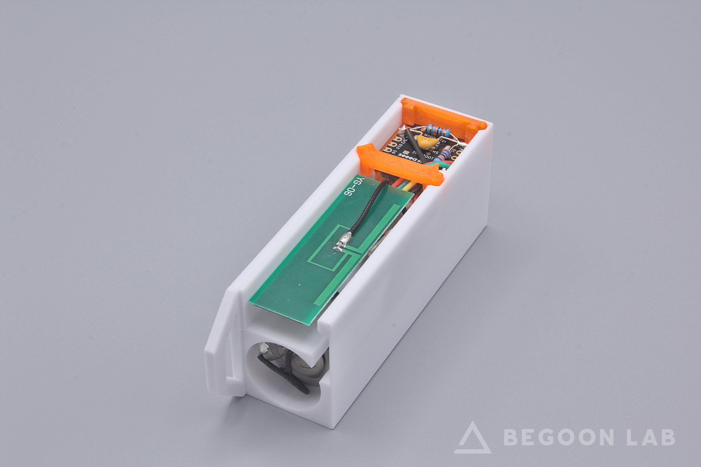

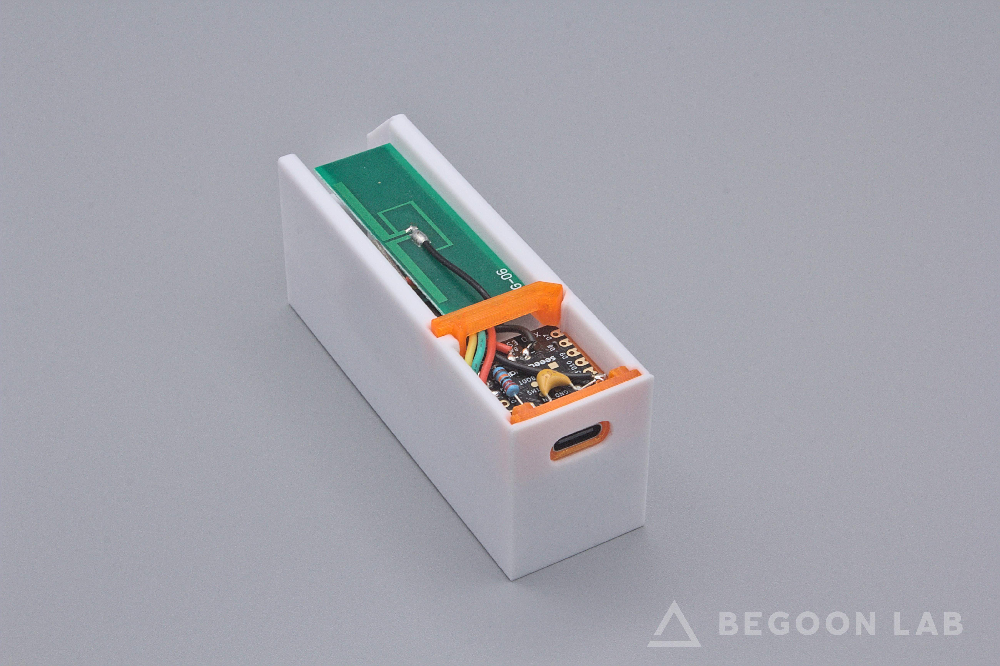

7. Insert [lock](3d/enclosure/stl/lock.stl) into the [core part](3d/enclosure/stl/core.stl) as shown:

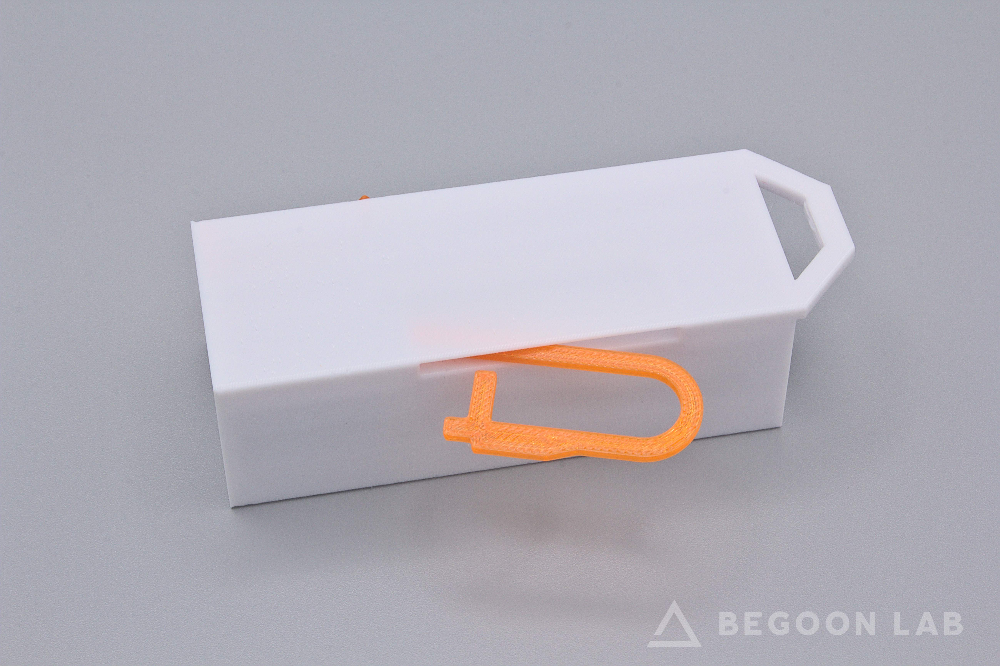

8. Finally, pull [the wrapper](3d/enclosure/stl/wrapper.stl) onto the [core part](3d/enclosure/stl/core.stl). Ensure that the [lock](3d/enclosure/stl/lock.stl) is securing the wrapper.

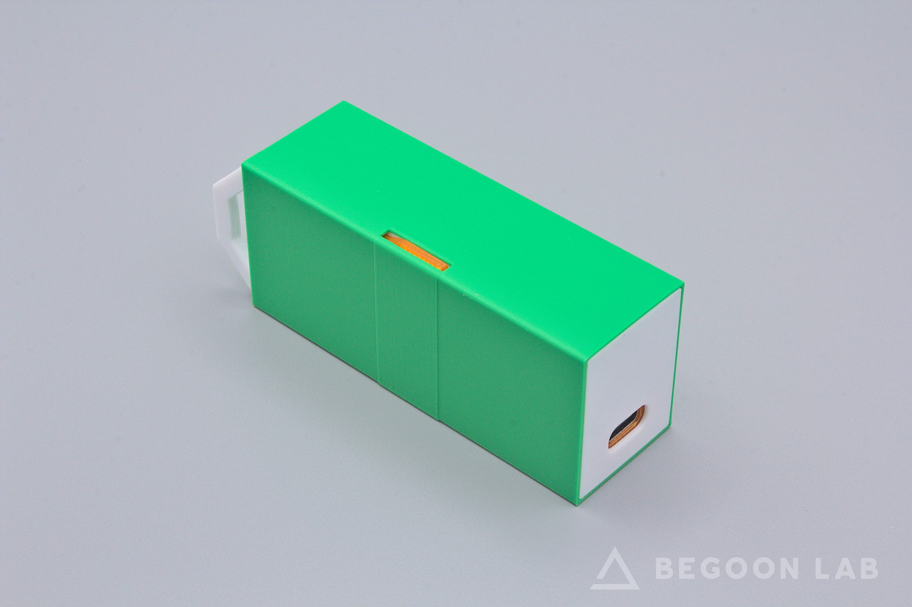

## Integration with Home Assistant

Integrate the Smart IoT Sensor with Home Assistant by following these steps:

1. **Set Up MQTT Server**: If you don't have an MQTT server, refer to the [Home Assistant MQTT Integration](https://www.home-assistant.io/integrations/mqtt/) guide.
2. **Configure `configuration.yaml`**: Add the following configuration to your `configuration.yaml` file to define the sensor entities.

```yaml
---
mqtt:
  sensor:
    - name: "Sensor RSSI 7i29r9k9ltaxmbev"
      device_class: signal_strength
      state_topic: "xiao/sensor/7i29r9k9ltaxmbev/data"
      unit_of_measurement: "dBm"
      value_template: "{{ value_json.RSSI }}"

    - name: "Sensor Temperature 7i29r9k9ltaxmbev"
      device_class: temperature
      state_topic: "xiao/sensor/7i29r9k9ltaxmbev/data"
      unit_of_measurement: "°C"
      value_template: "{{ value_json.temperature }}"

    - name: "Sensor Humidity 7i29r9k9ltaxmbev"
      device_class: humidity
      state_topic: "xiao/sensor/7i29r9k9ltaxmbev/data"
      unit_of_measurement: "%"
      value_template: "{{ value_json.humidity }}"

    - name: "Sensor Pressure 7i29r9k9ltaxmbev"
      device_class: pressure
      state_topic: "xiao/sensor/7i29r9k9ltaxmbev/data"
      unit_of_measurement: "hPa"
      value_template: "{{ value_json.pressure }}"

    - name: "Sensor Battery Voltage 7i29r9k9ltaxmbev"
      device_class: voltage
      state_topic: "xiao/sensor/7i29r9k9ltaxmbev/data"
      unit_of_measurement: "V"
      value_template: "{{ value_json.battery_voltage }}"

    - name: "Sensor Connection Duration 7i29r9k9ltaxmbev"
      device_class: duration
      state_topic: "xiao/sensor/7i29r9k9ltaxmbev/data"
      unit_of_measurement: "ms"
      value_template: "{{ value_json.connection_duration_ms }}"
```

3. **Restart Home Assistant**: After updating the configuration, restart Home Assistant to apply the changes.
4. **Configure Entity Card**: Here is an example configuration for the entity card:

```yaml
---
type: entities
entities:
  - entity: sensor.sensor_temperature_7i29r9k9ltaxmbev
    icon: mdi:thermometer-low
    secondary_info: last-changed
    name: Temperature
  - entity: sensor.sensor_humidity_7i29r9k9ltaxmbev
    name: Humidity
  - entity: sensor.sensor_pressure_7i29r9k9ltaxmbev
    name: Pressure
  - entity: sensor.sensor_rssi_7i29r9k9ltaxmbev
    icon: mdi:wifi-strength-3
    secondary_info: none
    name: RSSI
  - entity: sensor.sensor_battery_voltage_7i29r9k9ltaxmbev
    icon: mdi:battery-80
    secondary_info: none
    name: Battery
  - entity: sensor.sensor_connection_duration_7i29r9k9ltaxmbev
    name: Connection Duration
title: Sensor 7i29r9k9ltaxmbev
```

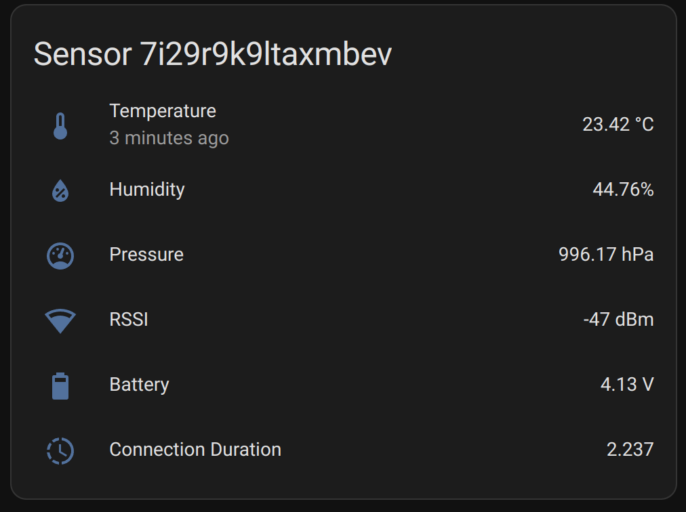

## Getting Started

Follow these steps to set up your Smart IoT Sensor:

1. **Clone the Repository**

   ```bash
   git clone https://github.com/BegoonLab/xiao-esp32c6-wifi-sensor
   cd xiao-esp32c6-wifi-sensor
   git submodule update --init --recursive
   ```

2. **Install Dependencies**

   Ensure you have the necessary tools and libraries installed. Refer to the [Software](#software) section for more details.

3. **Configure the Sensor**

   Edit the configuration files to set your Wi-Fi and MQTT credentials.

4. **Build and Flash**

   Compile the firmware and flash it to your XIAO ESP32C6 board.

5. **Assemble the Hardware**

   Connect the BME sensor and battery as per the schematics. 3D print the enclosure and assemble the components.

6. **Deploy and Monitor**

   Power on the sensor and monitor the data through your MQTT broker and Home Assistant.

## Hardware

### Components Required

- **XIAO ESP32C6**: The main microcontroller unit.
- **Bosch BME280 or BME680 Sensor**: For measuring temperature, humidity, and pressure.
- **LiPo Battery**: Any standard LiPo battery compatible with XIAO's charge management.
- **Voltage Divider Components**: If battery voltage monitoring is required.
- **Additional Components**:
  - Connectors and cables
  - External antenna (optional, but highly recommended for weak Wi-Fi signals). This is RSSI without and then with external antenna: 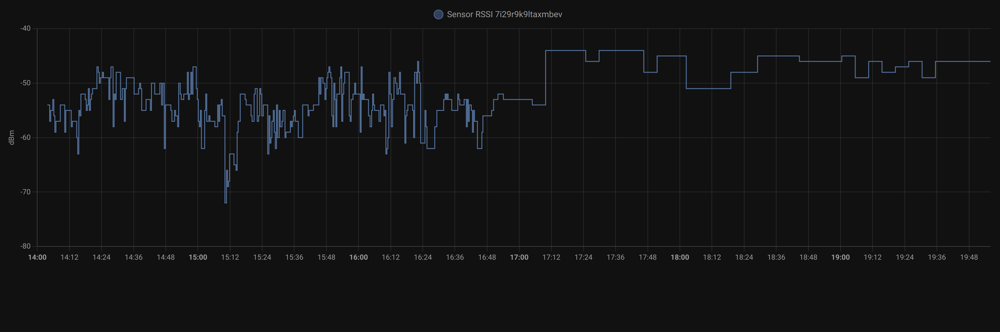
    - These antennas tested and worked quite well with this build:
    - PCB Antenna 5dBi and U.FL connector
    - 
    - RadioMaster FPV Drone antenna
    - 

### Assembly Instructions

1. **Mount the Sensor**: Connect the BME280/BME680 to the XIAO ESP32C6.
2. **Connect the Battery**: Ensure the battery is properly connected to the charge management circuitry.
3. **Set Up Voltage Divider**: If monitoring battery voltage, assemble the voltage divider as per the schematic.
4. **Enclose the Assembly**: Use the 3D-printed enclosure to house all components securely.

## Software

### Dependencies

- **ESP-IDF**: [Official development framework](https://docs.espressif.com/projects/esp-idf/en/v5.3.1/esp32/get-started/index.html#software) for Espressif chips.

### Building the Firmware

1. **Install ESP-IDF**

   Follow the [ESP-IDF Getting Started Guide](https://docs.espressif.com/projects/esp-idf/en/v5.3.1/esp32/get-started/index.html) to set up the development environment.

2. **Configure the Project**

   ```bash
   idf.py menuconfig
   ```

   - Set Wi-Fi credentials
   - Configure MQTT broker details
   - Enable or disable optional features

3. **Build and Flash**

   ```bash
   idf.py build
   idf.py -p <TARGET_PORT> flash
   ```

When a sensor misbehaves, it's helpful to output logs to diagnose the issue. By default, logging is disabled. To enable it, follow these steps:

1. Open the configuration menu:
   ```bash
   idf.py menuconfig
   ```
2. Navigate to:
   `Component config` → `Log output` → `Default log verbosity`.
3. Set the verbosity level to `Info`.
4. Save the changes, and then execute the following command to build, flash, and monitor:
   ```bash
   idf.py -p <TARGET_PORT> build flash monitor
   ```

## ZigBee

ZigBee can be activated in the menu:

```bash
idf.py menuconfig
```

Navigate to `XIAO Sensor Configuration` → `Select Sensor Connection Type` → `ZigBee`.

Next, go to `Component config` → `Zigbee` → `Zigbee Enable` and set it to ON. Then, go to `XIAO Sensor Configuration` → `ZigBee Configuration` and set a `Sensor ID`.

Build and flash the firmware. After that, the sensor will be ready and will begin commissioning.

To add the sensor to Home Assistant: go to `Settings` → `Devices & Services` → `Devices` → `Add Device` → `Add Zigbee device`. Once completed, your sensor will appear on the Devices page:

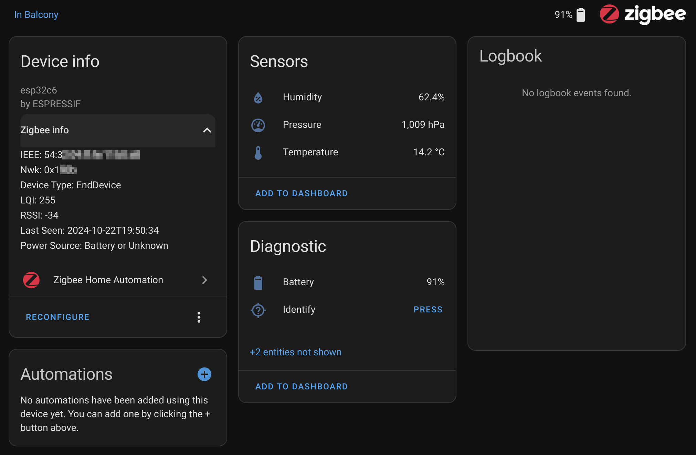

_Note_: The SGP41 sensor is not currently supported because the ZigBee protocol does not include VOC and NOx clusters in its specification.

## Contributing

Contributions are welcome! Please follow these steps:

1. **Fork the Repository**
2. **Create a Feature Branch**

   ```bash
   git checkout -b feature/YourFeature
   ```

3. **Commit Your Changes**
4. **Push to the Branch**

   ```bash
   git push origin feature/YourFeature
   ```

5. **Open a Pull Request**

## License

This project is licensed under the [MIT License](LICENSE). All rights reserved.

## TODO

- **Wi-Fi 6 Support**: Enhance connectivity options with Wi-Fi 6.
- **Bluetooth Provisioning**: Implement Bluetooth-based provisioning for easier setup.
- **Additional Sensor Support**: Expand compatibility with other types of sensors.
