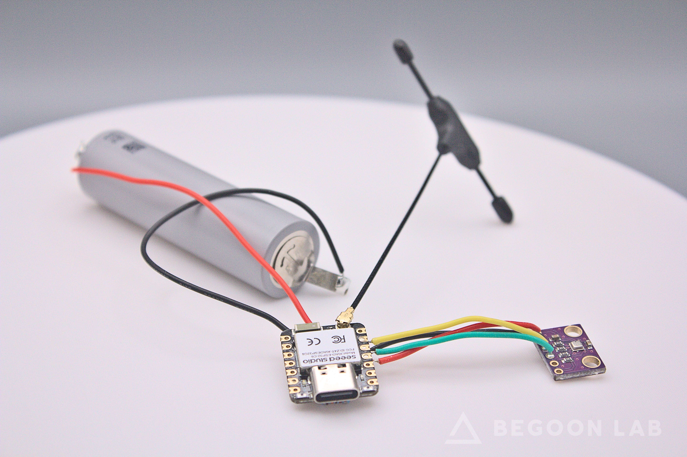
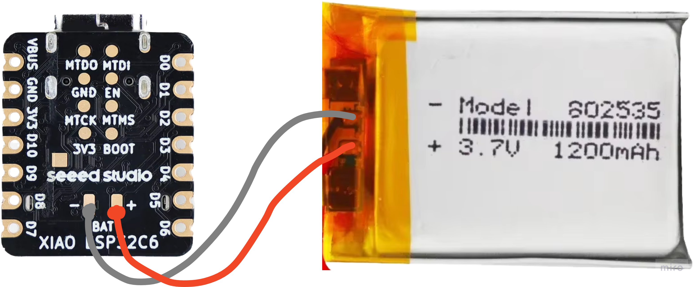
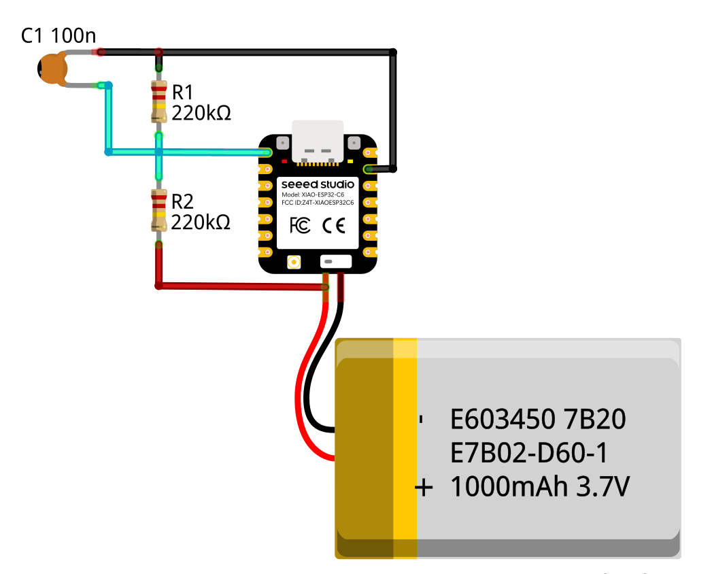
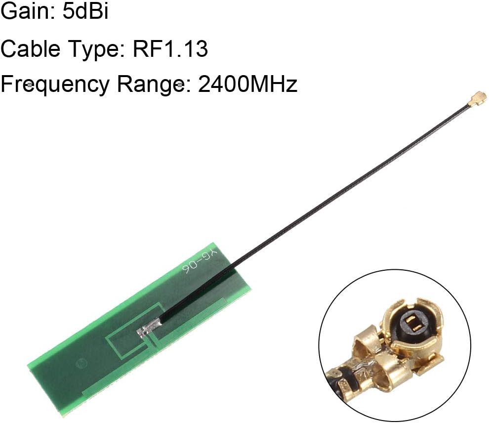
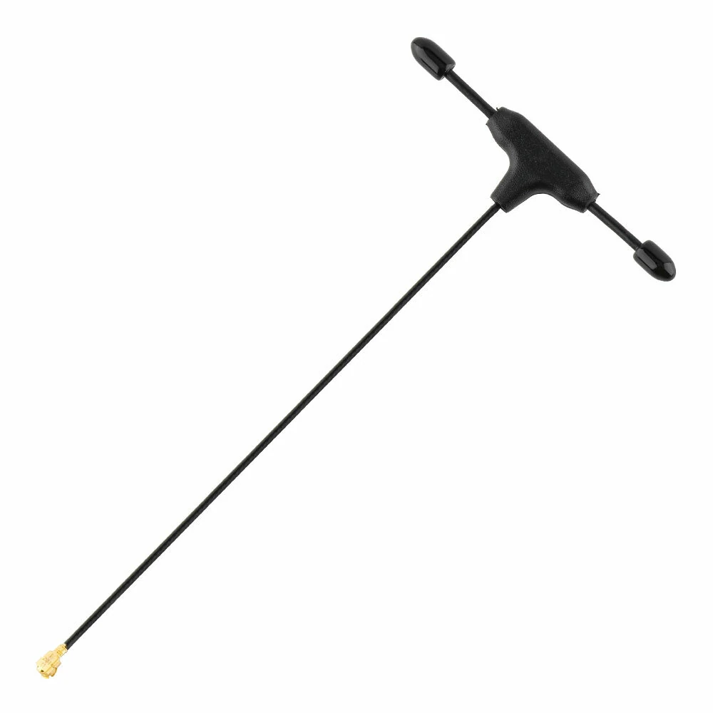

# Smart IoT Sensor built with XIAO ESP32C6

**WiFi, MQTT, BME280/BME680 Integration & Power Management**

## Table of Contents

- [Introduction](#introduction)
- [Features](#features)
- [Usage](#usage)
- [Schematics](#schematics)
- [Configuration](#configuration)
- [Enclosure](#enclosure)
- [Integration with Home Assistant](#integration-with-home-assistant)
- [Getting Started](#getting-started)
- [Hardware](#hardware)
- [Software](#software)
- [Contributing](#contributing)
- [License](#license)
- [TODO](#todo)

## Introduction

The Smart IoT Sensor is a power-efficient device built using the [XIAO ESP32C6](https://wiki.seeedstudio.com/xiao_esp32c6_getting_started/) tiny board. It integrates WiFi connectivity, MQTT messaging, environmental sensing with BME280/BME680 sensors, and robust power management, making it an ideal solution for smart home and IoT applications.



## Features

- **WiFi Connectivity**: Seamless connection to your home or office network.
- **MQTT Integration**: Publishes sensor data to an MQTT broker in JSON format.
- **Environmental Sensing**: Supports [Bosch BME280](https://www.bosch-sensortec.com/products/environmental-sensors/humidity-sensors-bme280/) and [BME680](https://www.bosch-sensortec.com/products/environmental-sensors/gas-sensors/bme680/) sensors for temperature, humidity, and pressure measurements.
- **Power Management**: Efficiently manages power using LiPo batteries with built-in charge management.
- **Deep Sleep Mode**: Extends battery life by enabling deep sleep between data transmissions.
- **Optional Features**:
    - Battery voltage monitoring
    - Connection duration tracking
    - Future support for WiFi 6 and Bluetooth provisioning (TODO)

## Usage

The Smart IoT Sensor can be easily integrated with [Home Assistant](https://www.home-assistant.io/) for real-time monitoring and automation.

### MQTT Data Structure

The sensor publishes data to an MQTT broker in the following JSON format:
```json
{
  "ID": "7i29r9k9ltaxmbev",
  "RSSI": -54,
  "battery_voltage": 4.13,
  "temperature": "24.28",
  "humidity": "29.32",
  "pressure": "999.54",
  "connection_duration_ms": 1672
}
```
- **ID**: Unique identifier of the sensor
- **RSSI**: WiFi signal strength in dBm
- **battery_voltage**: Current battery voltage
- **temperature**: Temperature reading from the BME sensor
- **humidity**: Humidity reading from the BME sensor
- **pressure**: Pressure reading from the BME sensor
- **connection_duration_ms**: Time taken to establish the MQTT connection

# Schematics

### Battery Connection

*A battery connection schematic.*

### Voltage Divider

*Voltage divider schematic (if battery voltage monitoring is required).*

**Note:** This solution continuously consumes some current from the battery but is functional for voltage monitoring.

## Configuration

This build developed and tested with [ESP-IDF v5.3.1](https://github.com/espressif/esp-idf/releases/tag/v5.3.1)
Follow [this instruction](https://docs.espressif.com/projects/esp-idf/en/v5.3.1/esp32/get-started/index.html#manual-installation) to install it. It is required.

Configure the sensor using the following steps:

```
idf.py menuconfig
```

Then go to `XIAO Sensor Configuration`

1. **Wi-Fi Configuration**: Set up your Wi-Fi credentials to enable network connectivity.
2. **MQTT Configuration**: Connect the sensor to your MQTT server by providing the necessary broker details.
3. **Battery Check (Optional)**: Enable battery voltage monitoring if power management insights are needed.
4. **BME Sensor Configuration (Optional)**: Choose between BME280 and BME680 sensors based on your requirements.
4. **Power Management Configuration**: Setup wakeup. The duration in seconds that the device will remain in deep sleep before waking up

## Enclosure

The sensor is housed in a customizable 3D-printed enclosure. STL files are available for download and 3D printing.

*Placeholder for STL files download link or additional instructions.*

## Integration with Home Assistant

Integrate the Smart IoT Sensor with Home Assistant by following these steps:

1. **Set Up MQTT Server**: If you don't have an MQTT server, refer to the [Home Assistant MQTT Integration](https://www.home-assistant.io/integrations/mqtt/) guide.
2. **Configure `configuration.yaml`**: Add the following configuration to your `configuration.yaml` file to define the sensor entities.

```yaml
...
mqtt:  
  sensor:
    - name: "Sensor RSSI 7i29r9k9ltaxmbev"
      device_class: signal_strength
      state_topic: "xiao/sensor/7i29r9k9ltaxmbev/data"
      unit_of_measurement: "dBm"
      value_template: "{{ value_json.RSSI }}"

    - name: "Sensor Temperature 7i29r9k9ltaxmbev"
      device_class: temperature
      state_topic: "xiao/sensor/7i29r9k9ltaxmbev/data"
      unit_of_measurement: "°C"
      value_template: "{{ value_json.temperature }}"

    - name: "Sensor Humidity 7i29r9k9ltaxmbev"
      device_class: humidity
      state_topic: "xiao/sensor/7i29r9k9ltaxmbev/data"
      unit_of_measurement: "%"
      value_template: "{{ value_json.humidity }}"
      
    - name: "Sensor Pressure 7i29r9k9ltaxmbev"
      device_class: pressure
      state_topic: "xiao/sensor/7i29r9k9ltaxmbev/data"
      unit_of_measurement: "hPa"
      value_template: "{{ value_json.pressure }}"

    - name: "Sensor Battery Voltage 7i29r9k9ltaxmbev"
      device_class: voltage
      state_topic: "xiao/sensor/7i29r9k9ltaxmbev/data"
      unit_of_measurement: "V"
      value_template: "{{ value_json.battery_voltage }}"

    - name: "Sensor Connection Duration 7i29r9k9ltaxmbev"
      device_class: duration
      state_topic: "xiao/sensor/7i29r9k9ltaxmbev/data"
      unit_of_measurement: "ms"
      value_template: "{{ value_json.connection_duration_ms }}"
...
```
3. **Restart Home Assistant**: After updating the configuration, restart Home Assistant to apply the changes.

## Getting Started

Follow these steps to set up your Smart IoT Sensor:

1. **Clone the Repository**

    ```bash
    git clone https://github.com/BegoonLab/xiao-esp32c6-wifi-sensor
    cd xiao-esp32c6-wifi-sensor
    git submodule update --init --recursive
    ```

2. **Install Dependencies**

   Ensure you have the necessary tools and libraries installed. Refer to the [Software](#software) section for more details.

3. **Configure the Sensor**

   Edit the configuration files to set your WiFi and MQTT credentials.

4. **Build and Flash**

   Compile the firmware and flash it to your XIAO ESP32C6 board.

5. **Assemble the Hardware**

   Connect the BME sensor and battery as per the schematics. 3D print the enclosure and assemble the components.

6. **Deploy and Monitor**

   Power on the sensor and monitor the data through your MQTT broker and Home Assistant.

## Hardware

### Components Required

- **XIAO ESP32C6**: The main microcontroller unit.
- **Bosch BME280 or BME680 Sensor**: For measuring temperature, humidity, and pressure.
- **LiPo Battery**: Any standard LiPo battery compatible with XIAO's charge management.
- **Voltage Divider Components**: If battery voltage monitoring is required.
- **Additional Components**:
  - Connectors and cables
  - External antenna (optional, but highly recommended for weak WiFi signals).
    - These antennas tested and worked quite well with this build: 
    - PCB Antenna 5dBi 
    - RadioMaster 
### Assembly Instructions

1. **Mount the Sensor**: Connect the BME280/BME680 to the XIAO ESP32C6.
2. **Connect the Battery**: Ensure the battery is properly connected to the charge management circuitry.
3. **Set Up Voltage Divider**: If monitoring battery voltage, assemble the voltage divider as per the schematic.
4. **Enclose the Assembly**: Use the 3D-printed enclosure to house all components securely.

## Software

### Dependencies

- **ESP-IDF**: [Official development framework](https://docs.espressif.com/projects/esp-idf/en/v5.3.1/esp32/get-started/index.html#software) for Espressif chips. 

### Building the Firmware

1. **Install ESP-IDF**

   Follow the [ESP-IDF Getting Started Guide](https://docs.espressif.com/projects/esp-idf/en/v5.3.1/esp32/get-started/index.html) to set up the development environment.

2. **Configure the Project**

    ```bash
    idf.py menuconfig
    ```
   - Set WiFi credentials
   - Configure MQTT broker details
   - Enable or disable optional features

3. **Build and Flash**

    ```bash
    idf.py build
    idf.py -p <TARGET_PORT> flash
    ```

## Contributing

Contributions are welcome! Please follow these steps:

1. **Fork the Repository**
2. **Create a Feature Branch**

    ```bash
    git checkout -b feature/YourFeature
    ```

3. **Commit Your Changes**
4. **Push to the Branch**

    ```bash
    git push origin feature/YourFeature
    ```

5. **Open a Pull Request**

## License

This project is licensed under the [MIT License](LICENSE). All rights reserved.

## TODO

- **Wi-Fi 6 Support**: Enhance connectivity options with Wi-Fi 6.
- **Bluetooth Provisioning**: Implement Bluetooth-based provisioning for easier setup.
- **Additional Sensor Support**: Expand compatibility with other types of sensors.

